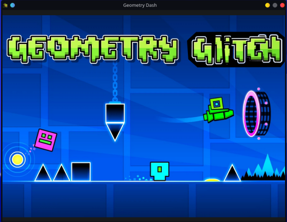
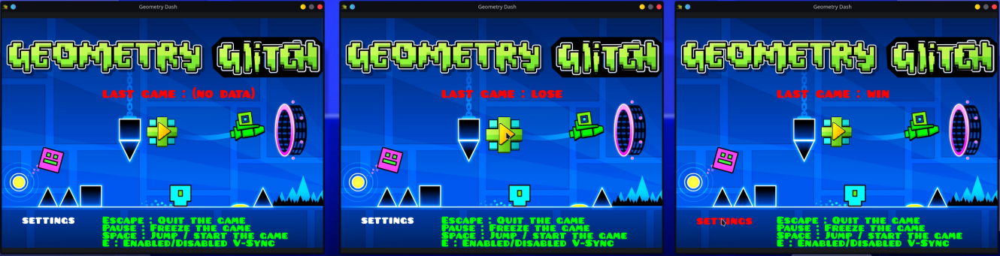
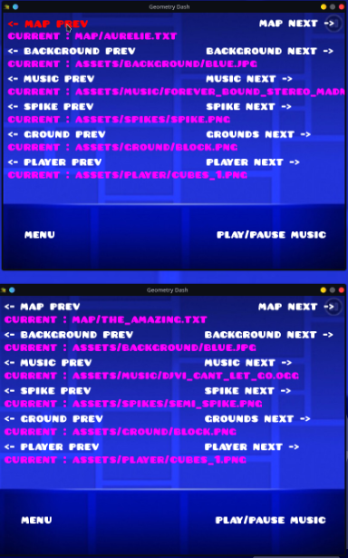
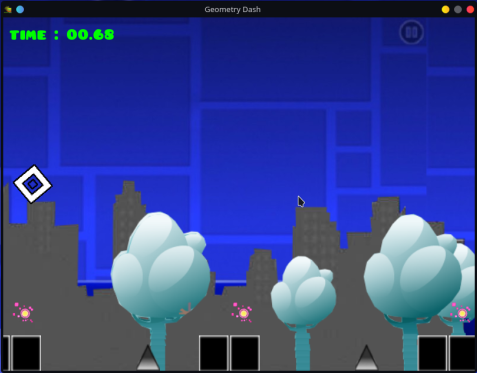
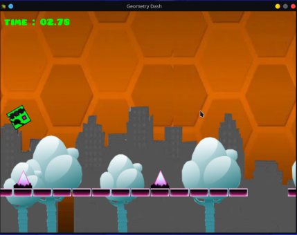
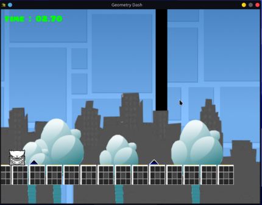

# MYRUNNER

*the* **gemotry glitch**!

# INGAME SCREEN

## Intro


## Menu


## Settings


## Game

)
)

# USAGE
```sh
Finite runner created with CSFML

USAGE
        ./my_runner map.txt [flag]

DESCRIPTION
        map.txt the map to load (for example : map/42.txt)

OPTIONS
        -h      print the usage
        -f      to force the fullscreen [use it if you dare]

USER INTERACTIONS
        Space   jump in the game / start the game
        Escape  quit the window
        Pause   pause the game / resume it
	E	(only in menu scene) enable/disable VSync
```
